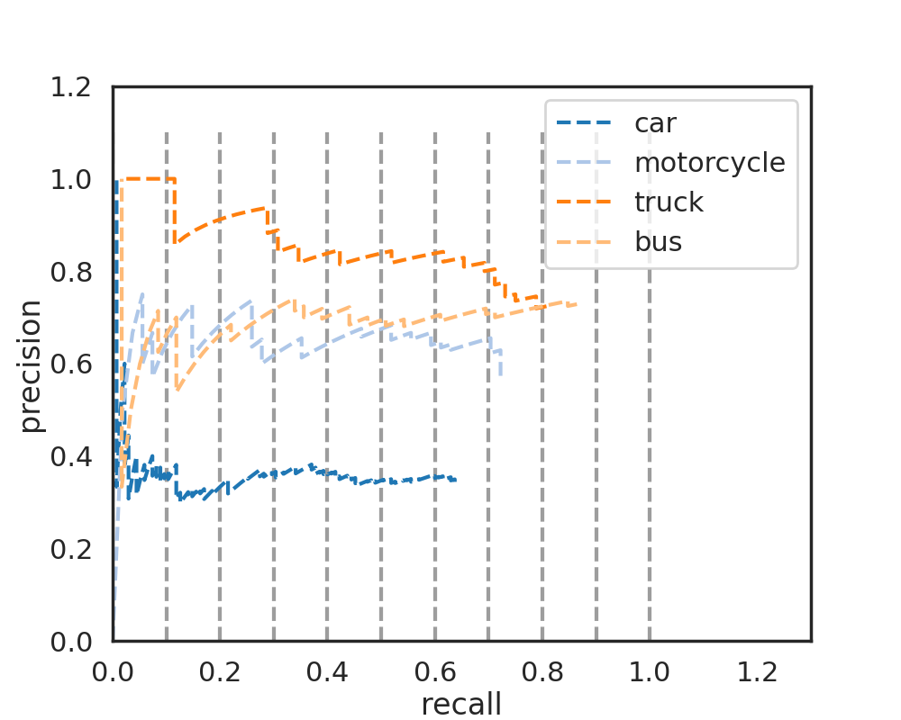
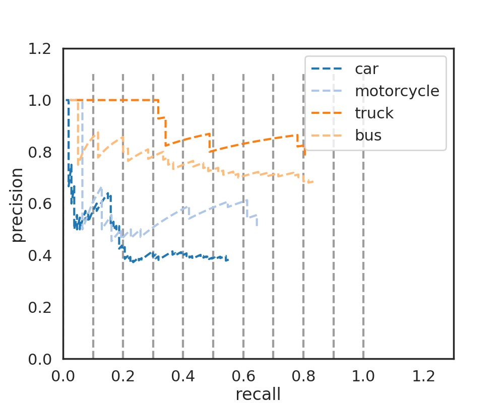
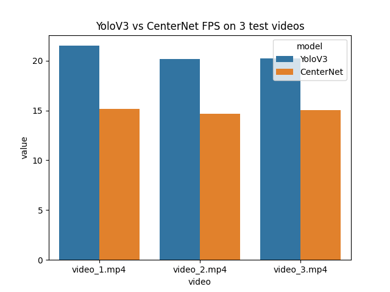
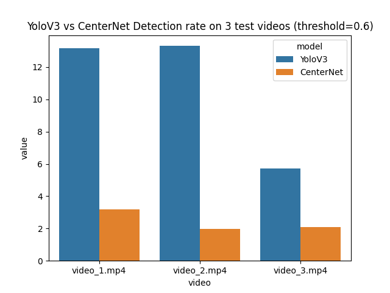

# Object-detection-models-comparison
A comparison of CenterNet and other State-of-the-art models in object detection

### 1. Download videos.
To download testing videos, go to videos folder and run the download.sh script.
Videos will be downloaded one by one.
```
cd videos
sh download.sh
```

### 2. Test model on individual image.
To test the detection models (yolo and centernet) on an individual image, execute the command:
```
python3 test.py --model <model_name> --input <path_to_image>
```

Where :
- model_name : Is the name of the model you want to test ("yolo" or "center").
- input : Path to the image file.

### 3. Test model on video.
To test the detection models (yolo and centernet) on a video, execute the command:
```
python3 test_video.py --model <model_name> --input <path_to_video>
```
Where :
- model_name : Is the name of the model you want to test ("yolo" or "center").
- input : Path to the video file.

The script will output the prediction in the form of gif into the default path "videos/output.gif".
However, you can change this by providing the script with another option "--output" which specifies
the output GIF path. For example :
```
python3 test_video.py --model yolo --input videos/video_1.mp4 --output videos/output_1.gif
```

#### Sample predictions:
<table>
<tr>
<th>Video #1 - Yolo</th>
<th>Video #2 - Yolo</th>
<th>Video #3 - Yolo</th>
</tr>
<tr>
<td></td>		
<td></td>		
<td></td>		
</tr>
</table>

<br/>

<table>
<tr>
<th>Video #1 - CenterNet</th>
<th>Video #2 - CenterNet</th>
<th>Video #3 - CenterNet</th>
</tr>
<tr>
<td></td>		
<td></td>		
<td></td>		
</tr>
</table>

### 4. Evaluate on testing image dataset.
To evaluate on a testing dataset, run the "test_batch.py" script and specify the path to the testing images
folder along with the model name. For example :
```
python3 test_batch.py --input data/images --model yolo
```
The results will be output to a json file :  "predictions/pr_{model_name}.json". The format of the json
file will be as followed:
```json
{
	"<class_name>" : {
		"<file_name>.jpg" : {
			"boxes" : [[...]],
			"scores" : [...]
		},
		...
	},
	...
}
```

The ground truth of the vehicle dataset is stored in the ground truth json file "predictions/gt_vehicle.json".
To plot the precision-recall curve of the predictions, run the "pr_curve.py" script and specify the JSON
files to the ground truth and the predictions JSON. For example :
```
python3 pr_curve.py --gt predictions/gt_vehicle.json --pr predictions/pr_yolo.json
```

The figure will be output to a file named "PR_curve.png". However, you can change this behaviour by specifying
an option "--output" to the pr_curve.py script.

#### Precision and recall curve for YoLo and CenterNet on the same dataset
<table>
<tr>
<th>Yolo</th>
<th>CenterNet</th>
</tr>
<tr>
<td></td>
<td></td>
</tr>
</table>

#### Mean Average Precision (mAP) by classes
<table>
<tr>
<th>mAP</th>
<th>Car</th>
<th>Truck</th>
<th>Bus</th>
<th>Motorcycle</th>
</tr>
<tr>
<th>CenterNet</th>
<td><strong>0.39</strong></td>
<td><strong>0.76</strong></td>
<td><strong>0.69</strong></td>
<td>0.46</td>
</tr>
<tr>
<th>Yolo</th>
<td>0.30</td>
<td>0.71</td>
<td>0.61</td>
<td><strong>0.50</strong></td>
</tr>
</table>

### 5. Others
#### Measure models performance in real-time detection
To evaluate the performance of CenterNet and YoloV3 in real-time detection, the "measure_performance.py"
script is written to measure in two metrics : Frames per second (FPS) and Detection rate (Objects per frame).
To run the script, provide it with the following options:
```
python3 measure_performance --model <model_name> --input <path_to_video> --metric <metric_name>
```
Where:
- model_name : Refers to the model name ("center" or "yolo").
- path_to_video : Refers to path to video input ("videos/...mp4").
- metric_name : Refers to evaluation metrics ("fps" or "dr").

Performance metrics comparison summary:
<table>
<tr>
<th>FPS</th>
<th>Detection Rate</th>
</tr>

<tr>
<td></td>
<td></td>
</tr>
</table>

# TODO:
- [x] Test and visualize the detection results on the testing youtube videos.
- [ ] Calculate the model complexity using FLOPS on ResNet (18 - 101), HourGlass-104 and DLA-34 architectures.
- [x] Comparison with YoloV3:
	- [x] Compare the FPS rate of CenterNet vs YoloV3 on given videos.
	- [x] Visualize the Precision-Recall curve on a vehicle dataset for both models.
	- [ ] Plot the ROC curves for both models.
- [ ] Read paper reviews and discuss limitations and possible improvements for CenterNet.

# REFERENCES:
- GluonCV: Testing pre-trained CenterNet models : [Link](https://cv.gluon.ai/build/examples_detection/demo_center_net.html)
- GluonCV: Testing pre-trained YoloV3 models : [Link](https://cv.gluon.ai/build/examples_detection/train_yolo_v3.html)
- GluonCV: Model zoo : [Link](https://cv.gluon.ai/model_zoo/detection.html#centernet)
- CenterNet Paper - Objects as Points : [Link](https://arxiv.org/abs/1904.07850)
- Vehicle dataset for validation : [Link](https://public.roboflow.com/object-detection/vehicles-openimages)
- Precision-recall curve for object detection : [Link](https://gist.github.com/tarlen5/008809c3decf19313de216b9208f3734)
- How to interpret a precision-recall curve : [Link](https://scikit-learn.org/stable/auto_examples/model_selection/plot_precision_recall.html)
